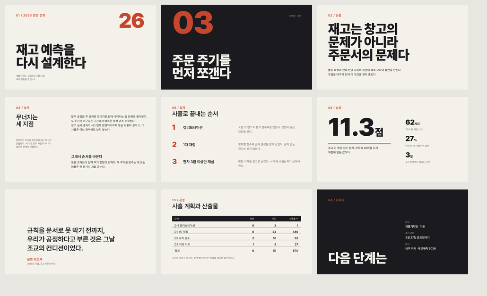
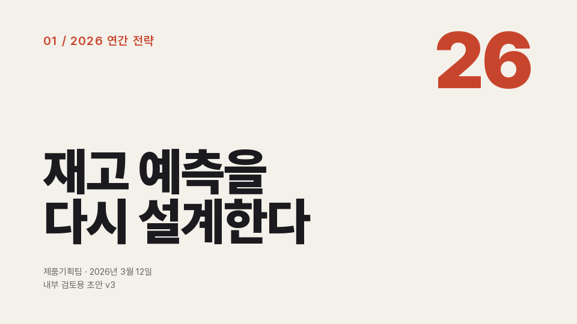
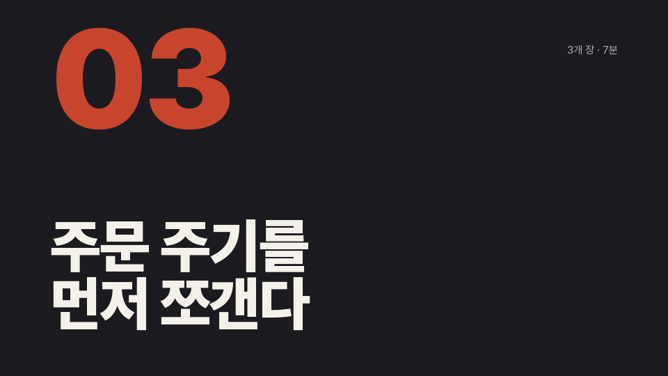
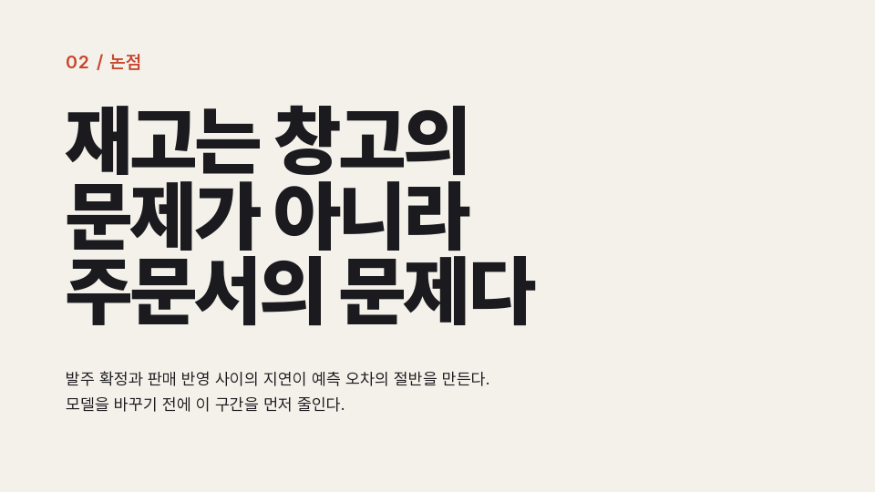
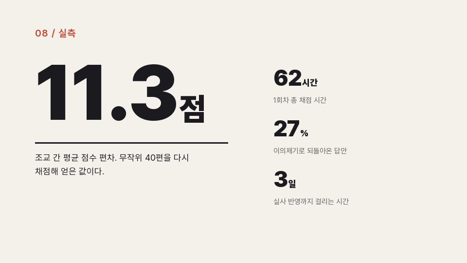
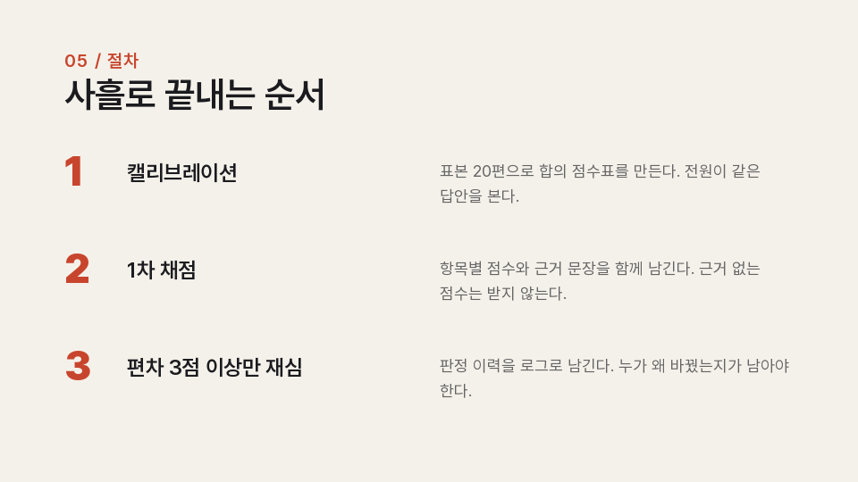
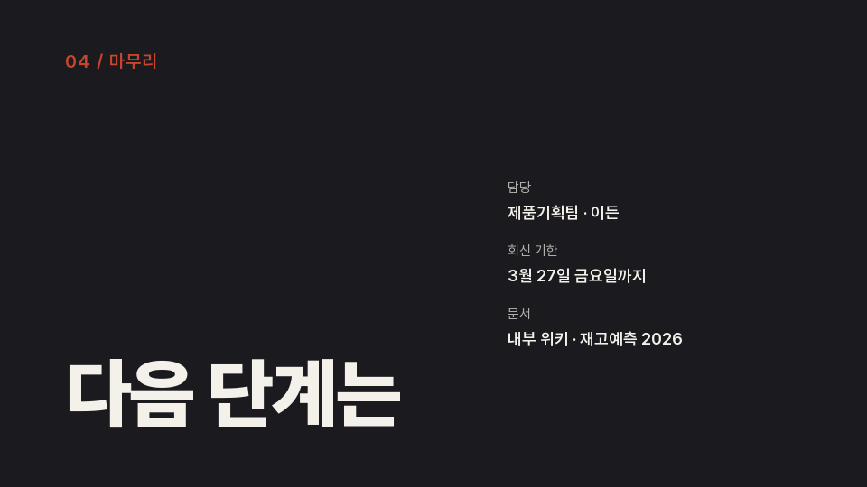
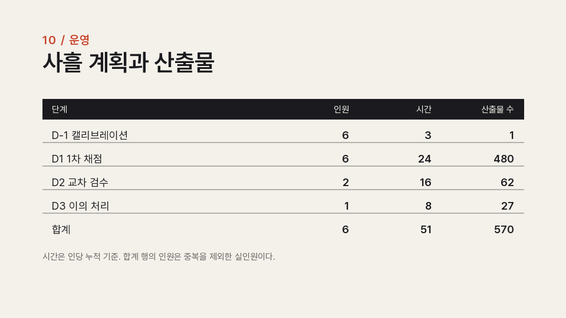

<div align="center">

# ppt-deck

**AI가 찍어낸 티가 나지 않는 한글 `.pptx`를 만드는 [Claude Code](https://claude.com/claude-code) 스킬**

디자인 토큰을 먼저 확정하고 · 레이아웃 11종을 리듬으로 배치하고 · AI 티를 린터가 막고 · 외부 앱 없이 눈으로 검수한다



</div>

---

HTML 슬라이드가 아니라 **PowerPoint에서 바로 열리는 네이티브 .pptx**를 만듭니다. 발표장 PC에 그대로 꽂아야 하는 사람을 위한 것입니다.

> A Claude Code skill that generates Korean PowerPoint decks which don't look AI-generated.
> Design tokens first, ten rhythmic layouts, a content linter for "AI tells", and visual QA with no external renderer.

<br>

## 왜 만들었나

AI로 만든 PPT는 내용과 무관하게 알아봅니다. 원인은 대부분 디자인 감각이 아니라 **구조**입니다.

| 티 나는 지점 | ppt-deck의 처리 |
| --- | --- |
| 전 슬라이드가 "제목 + 불릿" 한 골격 | 레이아웃 11종을 리듬으로 배치. 같은 레이아웃 3연속은 린터가 막는다 |
| Office 기본 파랑 `#4472C4`, 맑은 고딕 | 팔레트당 hex 3개만. Pretendard 4단 웨이트 |
| 사방 균등 여백 + 중앙 정렬 대칭 | 비대칭 12컬럼 그리드. 좌측 정렬 고정 |
| 텍스트박스 눈대중 배치 | 좌표가 그리드 함수에서만 나온다. 하드코딩 불가 |
| 폰트 크기 종류 남발 | 타입 스케일 14단. 이 표에 없는 크기는 존재하지 않는다 (린터 `SCALE`이 강제) |
| 그림자·둥근모서리·그라데이션·3D | 생성 경로 자체가 없다 |
| **제목 밑 강조선, 카드 모서리 색줄** | **만들지 않는다.** 남은 줄은 표 머리·데이터 밑줄 같은 구조적인 것뿐 |
| 같은 크기 숫자 3개를 나란히 (대시보드 위젯) | `data`는 히어로 1 + 종속 3행의 비대칭 위계 |
| 카드 3열 그리드 반복 | **항목 수가 구성을 결정** — 2 pair / 3 ledger / 4 quad / 5–6 dense |
| 내용 적은 장의 하단 공백 과다 | 상단 56 / 하단 484 **이분법**. 눈썹은 항상 56 고정이라 공백이 프레임이 된다 |
| 완결 문장 불릿, 기계적 병렬, 이모지 | 린터가 `SENTENCE` / `UNIFORM` / `PARALLEL` / `EMOJI`로 잡는다 |

**가장 큰 원인은 디자인이 아니라 문장입니다.** 그래서 린터의 절반이 콘텐츠 검사입니다.

```
✗ [RHYTHM]   'two_col' 3연속. 모든 장이 같은 골격이면 그게 AI PPT다
✗ [DENSITY]  불릿 4개 > speaker 한도 3개. 글자를 줄이지 말고 슬라이드를 쪼개라
· [UNIFORM]  불릿 길이가 [11, 9, 10]로 균일하다. 사람은 이렇게 안 쓴다
· [PARALLEL] 제목 3개가 'AI'로 시작한다 — 'X의 이해/활용/전망'식 목차
· [SENTENCE] 불릿이 완결 문장이다 — 명사구로 잘라라
· [CLICHE]   상투어 '다양한' — 구체적 명사로 바꿔라
```

<br>

## 레이아웃 10종

<table>
<tr>
<td width="50%"><br><code>cover</code> · 표지</td>
<td width="50%"><br><code>section</code> · 장 구분, accent 전면 반전</td>
</tr>
<tr>
<td><br><code>statement</code> · 주장 한 줄. 호흡을 끊는다</td>
<td><br><code>data</code> · 히어로 1 + 보조 2의 비대칭 위계</td>
</tr>
<tr>
<td><br><code>cards</code> · 항목 수가 구성을 정한다 (ledger = 3개)</td>
<td><br><code>closing</code> · 반전 필드 + 정보 원장</td>
</tr>
<tr>
<td colspan="2"><br><code>table</code> · 네이티브 표를 쓰지 않는다. 테마 표스타일의 줄무늬 채움과 전체 테두리가 가장 알아보기 쉬운 템플릿 지문이라 헤어라인으로 직접 그린다</td>
</tr>
</table>

나머지 셋 — `two_col`(본문 주력, 비대칭 4:7) · `image_full`(전출혈 이미지 + 바탕색 판) · `quote` · `closing`

<br>

## 설치

```bash
git clone https://github.com/jkkms/ppt-deck.git ~/.claude/skills/ppt-deck
cd ~/.claude/skills/ppt-deck
python3 -m venv .venv && .venv/bin/pip install -r requirements.txt
.venv/bin/python scripts/metrics.py      # 설치된 Pretendard 실측 글리프 폭 캐시
```

Claude Code에서 `/ppt-deck`으로 호출합니다.

**필요한 것** — [Pretendard](https://github.com/orioncactus/pretendard) (Black / SemiBold / Medium / Regular). 임베딩까지 쓰려면 `public/static/alternative/`의 **TTF** 빌드를 설치하세요. LibreOffice는 선택이고, 없어도 검수가 됩니다.

<br>

## 쓰는 법

아웃라인은 YAML 하나입니다. 문법은 [`references/outline.example.yaml`](references/outline.example.yaml) 참조.

```yaml
meta:
  title: "재현 가능한 채점 파이프라인"
  palette: letterpress      # letterpress | blueprint | graphite | dive
  density: speaker          # speaker(발표용) | reading(읽기용)

slides:
  - layout: cover
  - layout: section
    number: "01"
    title: "채점은 왜 매번 무너지는가"
  - layout: data
    title: "재채점 실측"
    items:                  # 순서가 곧 위계. 첫 항목이 히어로
      - {value: "11.3", unit: "점", caption: "조교 간 평균 점수 편차"}
      - {value: "62", unit: "시간", caption: "1회차 총 채점 시간"}
  - layout: image_split
    image: "photos/vision.png"
    side: right             # right(기본) | left
    fit: cover              # cover(잘라 채움) | contain(통째로)
    focus: top              # 세로 크롭 기준선. 인물 사진은 top
    title: "보고 구별합니다"
```

```bash
PY=.venv/bin/python

$PY scripts/lint.py       outline.yaml                    # 내용·리듬의 AI 티
$PY scripts/build.py      outline.yaml -o out/deck.pptx   # 빌드 + 기하 자기검증
$PY scripts/svgpreview.py out/deck.manifest.json --png --sheet   # 시각 검수
$PY scripts/validate.py   out/deck.pptx                   # 파일 무결성
```

<br>

## 검수가 네 단계입니다

| 단계 | 무엇을 본다 | 도구 |
| --- | --- | --- |
| **내용** | 문장형 불릿 · 기계적 병렬 · 상투어 · 리듬 · 밀도 · 이미지 누락 | `lint.py` |
| **기하** | 넘침 · 겹침 · 캔버스 이탈 · 불릿 줄바꿈 · 이미지가 글자를 덮는가 | `build.py` |
| **시각** | 구성 · 균형 · 색 · 여백 | `svgpreview.py` |
| **파일** | XML · 관계 · 콘텐츠타입 · 글꼴 · endParaRPr · 임베딩 구조 | `validate.py` |

`svgpreview.py`는 **설치된 Pretendard TTF를 직접 읽어 PIL로 그립니다.** LibreOffice도 PowerPoint도 권한도 필요 없습니다. `--sheet`는 전체를 한 장에 늘어놓은 컨택트시트를 만듭니다.

<br>

## 한글 PPT의 함정 세 가지

이 스킬이 실제로 데어 보고 고친 것들입니다.

**1. `<a:ea>`를 안 넣으면 한글이 딴 글꼴로 렌더됩니다.** `python-pptx`의 `font.name`은 `<a:latin>`만 씁니다. 한글에는 `<a:ea>`가 적용되므로 latin만 지정하면 소용없습니다. 이 스킬은 모든 run에 latin·ea·cs를 다 씁니다.

**2. `<a:endParaRPr>`가 비면 글상자를 클릭하는 순간 글꼴이 튑니다.** 문단 끝(커서 위치)의 서식이 비면 테마로 폴백하는데, 기본 테마는 `latin=Calibri`, `script="Hang"=맑은 고딕`입니다. 슬라이드는 멀쩡한데 편집하려고 클릭하면 다른 글꼴이 뜹니다. 문단마다 endParaRPr를 채우고 `theme1.xml`도 함께 교체합니다.

**3. PowerPoint는 OTF 임베딩을 거부합니다.** Pretendard 공식 릴리스의 `public/static/`은 OTF(CFF)라 "저장할 수 없는 글꼴" 오류가 납니다. `public/static/alternative/`가 TrueType 빌드이고 패밀리명·메트릭·글리프 수가 동일해서 레이아웃 변화 없이 갈아끼울 수 있습니다. `validate.py`가 시그니처를 검사합니다.

```bash
$PY scripts/build.py outline.yaml -o out/deck.pptx --embed-fonts   # 굵기당 1~2MB
```

<br>

## 팔레트

hex 값은 팔레트당 **3개뿐**입니다. `muted`·`hairline`은 파생값이고, 혼합비를 명/암에서 다르게 가져가 대비를 보장합니다 (밝은 판 0.34 / 어두운 판 0.30 · ground ≥ 4.5:1, figure ≥ 1.7:1). 나머지 이름은 전부 그 3개의 의미론적 별칭입니다. 4번째 색이 필요해지면 색이 부족한 게 아니라 레이아웃이 틀린 것입니다.

| | 바탕 | 본문 | 강조 | 성격 |
| --- | --- | --- | --- | --- |
| `letterpress` | `#F4F1EA` | `#1B1B1F` | `#C8452D` | 편집디자인. 인쇄·배포물 |
| `blueprint` | `#122033` | `#EDE6D6` | `#D98E32` | 어두운 강당, 프로젝터 |
| `graphite` | `#FAFAF8` | `#22252A` | `#6E7F32` | 기술 문서, 고밀도 읽기 |
| `dive` | `#0E1A2B` | `#FFFFFF` | `#1B7FD4` | 강의용. `invert: true`로 명·암 교차 |

<br>

## 구조

```
SKILL.md                      Claude Code 오케스트레이션 (5단계)
references/deck-spec.yaml     디자인 토큰 단일 원천 — 색·폰트·스케일·그리드·밀도
references/font-metrics.json  Pretendard 실측 글리프 폭 (한글 0.8643em)
scripts/deckkit.py            엔진 — 그리드, ea 타이프페이스, endParaRPr, 테마 패치, 이미지
scripts/build.py              레이아웃 10종 + 기하 자기검증
scripts/lint.py               콘텐츠 AI 티 린터
scripts/svgpreview.py         매니페스트 → SVG/PNG
scripts/validate.py           파일 무결성
scripts/metrics.py            글리프 폭 추출
```

### 설계 계약

1. 색·크기·좌표는 전부 `deck-spec.yaml`에서 파생된다. 예쁘게 하려고 코드에 숫자를 박지 않는다
2. 넘치면 **글자를 줄이지 않고 내용을 쪼갠다.** 타입스케일 이탈이 AI 티의 최대 원인이다
3. 렌더해서 눈으로 보기 전에는 완료가 아니다
4. 허전하다고 줄을 하나 긋지 않는다. 허전하면 여백이 잘못된 것이다

<br>

## 알려진 한계

- **차트가 없습니다.** 숫자는 `data`의 큰 활자로 보여주거나, 차트를 이미지로 만들어 넣어야 합니다
- 벤다이어그램·타임라인 같은 도식은 표나 카드로 눌립니다
- 미리보기는 빌더와 같은 메트릭으로 줄을 나눕니다. **빌더가 놓친 넘침은 미리보기에서도 안 보입니다.** 커닝·합자·PowerPoint 고유의 줄바꿈 규칙은 재현하지 않습니다
- macOS에서 개발·검증했습니다

<br>

## 계보

- [zarazhangrui/frontend-slides](https://github.com/zarazhangrui/frontend-slides) — 디자인 토큰 선확정, show-don't-tell, 밀도 모드, 안티슬롭 규칙. HTML이 아닌 네이티브 .pptx로 옮겼습니다
- **Anthropic `pptx` 스킬** — 필수 QA 단계와 검증기 개념. "제목 밑 강조선·모서리 액센트 줄 금지" 지침을 받아들여 장식용 줄을 전부 걷어냈습니다
- [hugohe3/ppt-master](https://github.com/hugohe3/ppt-master) — SVG를 중간 표현으로 두는 미리보기. 외부 렌더러 없이 검수하는 경로가 여기서 나왔습니다
- [Pretendard](https://github.com/orioncactus/pretendard) by orioncactus (SIL OFL 1.1)

README의 예시 이미지는 이 저장소가 직접 생성한 것입니다.

<br>

## 라이선스

MIT
